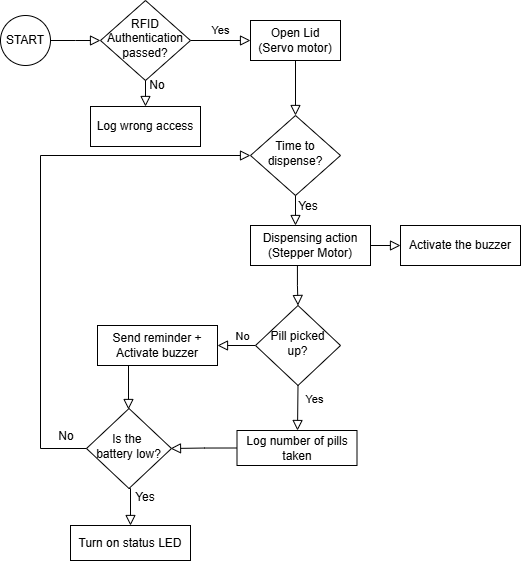
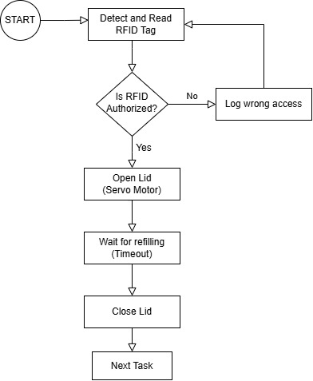
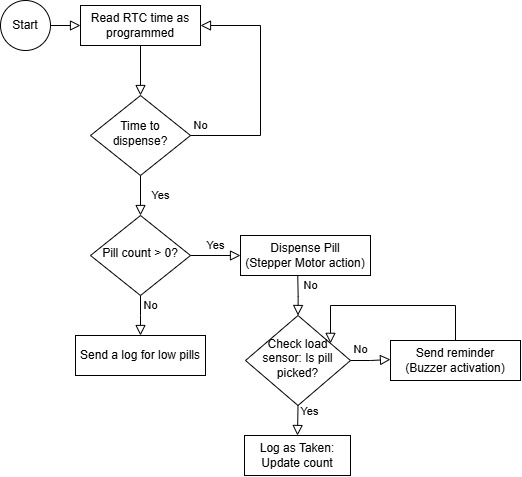

# a07g-exploring-the-CLI

* Team Number: 14
* Team Name: PillPal
* Team Members: Suhaila Shankar and Urvi Haval
* GitHub Repository URL: https://github.com/ese5160/final-project-a07g-a14g-t14-pillpal.git
* Description of test hardware: (development boards, sensors, actuators, laptop + OS, etc)

### Software Architecture

#### Hardware Requirements Specifications

(HR 01): Microcontroller Core
The project shall be based on the SAMW25 microcontroller module.

(HR 02): Access control for healthcare workers
An RFID reader shall be used for access control. The reader shall authenticate RFID tags at a maximum distance of 5 cm and communicate with the microcontroller via I2C.

(HR 03): Stepper motor specification
If the RFID tag matches the reader, the lid of the main compartment shall open, which is controlled by a 5V servo motor.

(HR 04): Regarding the action of the dispenser
The pill will be dispensed using a carousel design. A rotating disc is aligned with a dispensing chute. The disc rotates using a stepper motor to position the correct slot over the chute at the scheduled time, controlled by the RTC.

(HR 05): Dose alerts
The device shall include a buzzer for audio notifications. The buzzer shall produce a sound output of at least 65 dB at 50 cm and shall be activated for dose alerts.

(HR 06): Power Management
A Lithium Ion Cylindrical Battery - 3.7V, 2200mAh shall be used as the power source. The battery shall be parallely connected to a Boost Converter (5V) and a Buck Converter (3.3V).

(HR 07): Structure of the dispenser
The dispensing mechanism shall consist of two similar discs joined with an axle. The disc on the top will have 30 slots along its circumference where the pills will be placed and the lower disc will have 1 slot which shall align with one of the slots on the other disc to dispense the pill.

(HR 08): Structure of the enclosure
The device enclosure shall have dimensions of 30 x 30 x 45 cm and be made of acrylic. It shall include a transparent lid to check pill availability without opening the device. The dispenser mechanism will be 3d printed.

(HR 09): Internet Connectivity
The pill dispenser shall use 802.11 b/g/n Wi-Fi for communication with cloud services.

(HR 10): Low power indication
The device should feature two LEDs to display operational states such as low power and low wifi connectivity.

(HR 11): Pill weighing action
A load cell should be used to measure the weight of the pills when they are refilled. It should approximately be equal to the total weight of the dosage over a month.

(HR 12): Checking if the pill is taken
A load cell/force sensor should be placed at the end of the dispenser to check if the patient picks up the pill

#### Software Requirements Specifications

(SRS 01): A notification shall be sent to the patient when they need to take their medication. An RTC timer will be used to send notifications and dispense the pill.

(SRS 02): A reminder notification shall be sent in 5 minutes if the patient has not taken their medication.

(SRS 03): A counter shall keep track of the number of pills left in the dispenser and alert the patient and provider when there is 1 week of medication left for the user. The counter subtracts the pill amount every time the stepper motor dispenses the pill. When the RFID is used, the counter resets to the maximum number of pills.

(SRS 04): The microcontroller shall control the servo motor to open the lid of the compartment only after successful RFID authentication.

(SRS 05): A schedule shall be set by the provider to send reminders for taking pills and the stepper motor should be activated accordingly.

(SRS 06): The microcontroller shall log each successful activation of the servo and stepper motor, including timestamps, to maintain an activity history.

(SRS 07): If the servo motor fails to open the lid after authentication, the system shall alert the user and log the incident for troubleshooting.

(SRS 08): A boolean value should store information about whether the pill was picked up from the load cell.  

#### Block diagram  

#### Flowcharts  
1. High Level Flowchart  
  

2. RFID Authentication + Lid Unlocking  
  

3. RTC-based Dispensing + Pickup Detection + Reminder   
  

4. Low Battery Alerts  
  

5. Wi-Fi connectivity  
  

### Understanding Starter Code

#### 1. What does “InitializeSerialConsole()” do? In said function, what is “cbufRx” and “cbufTx”? What type of data structure is it? 

The "InitializeSerialConsole()"  initializes the UART and registers callbacks. "cbufRx" initializes the circular buffer for RX and "cbufTx" initializes the circular buffer for TX. It is a circular buffer data structure that is commonly used to implement an array and manage metadata such as a head, tail, and capacity. 

#### 2. How are “cbufRx” and “cbufTx” initialized? Where is the library that defines them (please list the *C file they come from). 
"cbufRx" and "cbufTx" is initialized usinf the circular_buf_init function. It is initialized in the circular_buffer.c file where the buffer and size are initialized. 

#### 3. Where are the character arrays where the RX and TX characters are being stored at the end? Please mention their name and size.
Tip: Please note cBufRx and cBufTx are structures.
Name is rxCharacterBuffer and txCharacterBuffer for storing received characters and characters to be sent. The size is 512 bytes. 

#### 5. Where are the interrupts for UART character received and UART character sent defined? 
The usart_read_callback function handles the UART receive interrupt and the usart_write_callback is used to handle the UART transmit interrupt. The usart_read_callback() function is triggered when the UART receives a character and the usart_write_callback() is triggered when the UART finishes sending a character. 

#### 6. What are the callback functions that are called when: 
The usart_read_callback function is designated to handle events when a character is received via UART. The function is registered as the callback for the USART_CALLBACK_BUFFER_RECEIVED event within the configure_usart_callbacks() function. For a character being sent, the function usart_write_callback is used to handle events. The usart_write_callback is called to manage post-transmission tasks such as sending the next character when available. 

#### 7. Explain what is being done on each of these two callbacks and how they relate to the cbufRx and cbufTx buffers. 
The usart_read_callback() handles character reception and is called automatically when a character is received via UART. This function stores the rceived character into the circular buffer and then restarts the UART read job to make sure that the new incoming characters are processed. The cufRx is used to store characters that will be processed later. The usart_write_callback is used to handle character transmission and is called automatically when the UART finishes sending a character. The function gets the next charcter from the cbufTx and starts a new transmission or stops if the buffer is empty. The cbufTx holds characters waiting to be sent which means that multiple characters can be sent asynchronously without blocking the CPU. Basically, it retrieves and sends the next character if available. 

#### 8. Draw a diagram that explains the program flow for UART receive – starting with the user typing a character and ending with how that characters ends up in the circular buffer “cbufRx”. Please make reference to specific functions in the starter code. 

#### 9. Draw a diagram that explains the program flow for the UART transmission – starting from a string added by the program to the circular buffer “cbufTx” and ending on characters being shown on the screen of a PC (On Teraterm, for example). Please make reference to specific functions in the starter code. 

#### 10. What is done on the function “startStasks()” in main.c? How many threads are started?
The function StartTasks is used to initialize application tasks in the function. It prints the available heap memory before task creation, creates the FreeRTOS task for the command line interface, and prints the available heap memory after task creation which compares the memory before and after task creation to help monitor memory consumption. The CLI-task is 1 thread that is user defined but there are implicit threads within FreeRTOs such as the Idle Task which runs when no other tasks are executing and the Timer Task which manages software timers. Therefore, 2-3 threads are running in total depending on the FreeRTOS configuration. 
