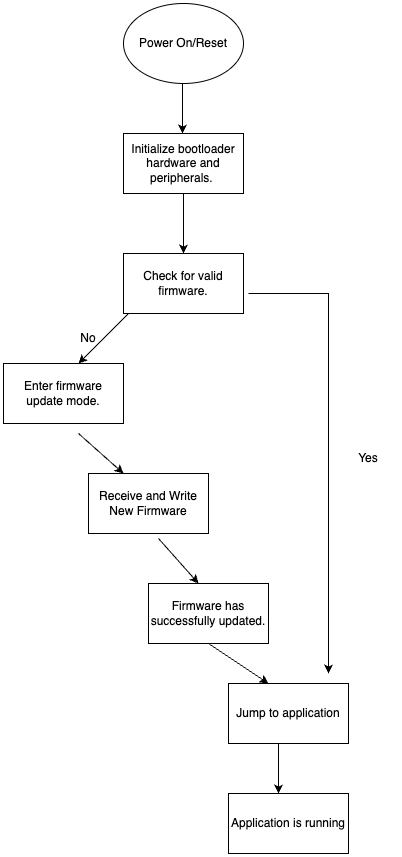

# a08g-comm-protocols

* Team Number: 14
* Team Name: PillPal
* Team Members: Suhaila Shankar and Urvi Haval
* GitHub Repository URL: https://github.com/ese5160/final-project-a07g-a14g-t14-pillpal.git
* Description of test hardware: Atmega SAMWD Microcontroller, Laptop

### Using Percepio

Screenshot of Percepio Trace

### Capture SD Card Comms

Block Diagram of Hardware Setup

Photo of your hardware connections between the SAMW25 Xplained dev board, the SD card module, and the logic analyzer:

Screenshot of the decoded message

Capture File of SD Card Communication

### Bootloader Design

1. A bootloader is a small piece of firmware that runs when an embedded system or microcontroller is powered on. It initializes the hardware and loads the main application firmware. The bootloader executes from a specific memory location which is usually at the beginning of the flash memory and ensures that the system starts up correctly. It can facilitate firmware updates without external program tools.

   When the system powers on, the bootloader initializes essential hardware components like the clock, GPIOs, and communication peripherals. It checks whether a valid application firmware exists in memory. If the firmware is intact and passes verification, the bootloader jumps to the application by setting the program counter to the application's entry point. The main firmware then takes control of the system and runs as intended.
   
   The bootloader enters firmware update mode if the firmware is missing or corrupted. THe bootloader waits for a new firmware from an external source and once the firmware is received, it is written to firmware memory and replaces the old or corrupted firmware. Once the firmware is updated, the bootloader resets the system, verifying the new written firmware before executing it. This process ensures that the embedded systems are reliable and can be updated without disassembling hardware. 
3. 

### CRC Checks

1. Submit firmware to the Github classroom assignment
2. Video of firmware switching when pressing SWO button
